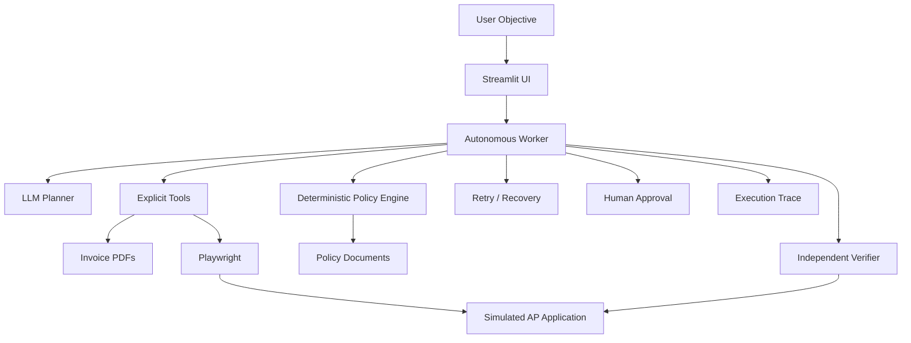

# 🤖 Autonomous Accounts Payable Worker

> A bounded AI worker that converts a natural-language AP objective into tool actions while deterministic policies, human approval, retries, and independent verification control execution.

## Why this project matters

Most LLM demos stop at text generation. This project focuses on **agentic execution**:

**Observe → Decide → Act → Recover/Escalate → Verify → Evidence**

The worker can discover invoice files, extract structured data, inspect policies, interact with a simulated AP application through browser automation, recover from transient failures, and verify the final record.

## Architecture



## Engineering principles

- **LLM for decisions, code for controls:** the model selects the next bounded tool/action; critical rules remain deterministic.
- **Never silently create duplicates:** duplicate and conflict checks run before writes.
- **Bounded retries:** only transient failures are retryable.
- **Human-in-the-loop:** ambiguous, conflicting, or approval-threshold cases pause safely.
- **Independent verification:** a successful submit response is not treated as proof of success.
- **Auditable execution:** observations, decisions, tool results, approvals, retries, and verification are persisted.

## Demo scenarios

| Scenario | Expected behavior |
|---|---|
| Transient failure | Retry within the configured limit, then verify |
| Exact duplicate | Block duplicate creation |
| Approval threshold | Pause for human approval before write execution |
| Missing critical field | Derive only when policy/vendor terms are explicit; otherwise escalate |
| Conflicting record | Block silent overwrite and require review |

## Failure classes

`TRANSIENT` · `PERMANENT` · `VALIDATION` · `DUPLICATE` · `POLICY` · `AMBIGUITY` · `AUTHORIZATION`

Only transient failures are retried. Safety-related failures are not retried as if they were temporary outages.

## Tech stack

`Python 3.11+` · `FastAPI` · `Streamlit` · `Playwright` · `SQLite` · `Pydantic` · `pypdf` · `ReportLab` · `OpenAI-compatible tool calling`

## Repository structure

```text
app/
data/
scripts/
simulated_ap/
streamlit_app/
tests/
run.py
requirements.txt
```

## Run locally

The repository is designed as a local simulation and does not require a real enterprise AP system.

```bash
git clone https://github.com/Riya-712/Autonomous-invoice-processing-agent.git
cd Autonomous-invoice-processing-agent

python -m venv .venv
# Windows
.venv\Scripts\activate

pip install -r requirements.txt

python run.py
```

Set the required model/provider variables in `.env` according to the repository configuration before running the LLM-powered flow.

## Testing

```bash
pytest -q
```

The tests cover extraction, policy logic, duplicate detection, retry behavior, and simulated AP health checks.

## Limitations

This is an **enterprise workflow simulation**, not a production AP connector. The AP application and invoice PDFs are synthetic, browser coverage is intentionally bounded, and there is no distributed queue or enterprise identity layer.

