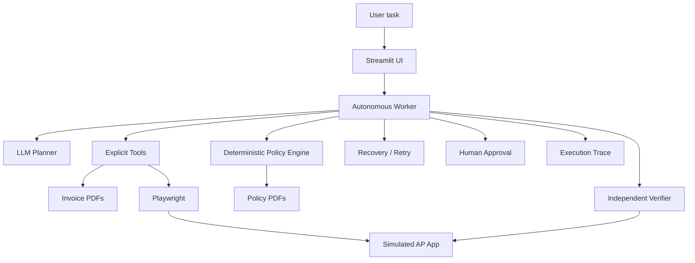

# Autonomous Accounts Payable Worker

A narrow enterprise AI-worker prototype for a CentrAlign AI-style workflow: a natural-language business objective is converted into bounded actions over files and a simulated internal AP application, with policy enforcement, duplicate protection, retries, human approval, execution tracing, and independent verification.

[Demo Link](http://localhost:8501)

## Why this is an AI worker, not a chatbot

The system does not merely explain how to process an invoice. It actually discovers invoice files, extracts structured data, checks company rules, interacts with a local AP application through browser automation, handles transient failure, and independently verifies the resulting record.

## Architecture

## Core loop

`Observe → Decide → Act → Observe → Recover/Escalate → Verify → Evidence`

## Key design decisions

- **Single worker instead of multi-agent:** the task is small enough that one stateful worker is easier to debug and trust.
- **LLM for decisions, deterministic code for controls:** the planner can select the next read/action tool, while amount thresholds, duplicate blocking, retry limits and verification are enforced in code.
- **Playwright:** proves the worker can operate a computer/application, not merely call a database API.
- **SQLite:** sufficient for a local enterprise simulation and makes state inspectable.
- **Independent verification:** a successful submit response is not treated as proof; the worker re-reads the saved record through the AP UI and compares critical fields.
- **Human-in-the-loop:** ambiguity, conflicting records and approval thresholds pause the worker rather than causing unsafe guessing.

## Demo scenarios

### 1. Happy / transient retry

`Find the latest invoice from ABC Office Supplies and process it.`

The AP submit boundary is configured to fail once with a simulated transient error; the worker classifies it as retryable, retries within the configured bound, then verifies the record.

### 2. Duplicate protection

`Find invoice ACME-2026-104 from Acme Corporation and process it.`

An identical AP record is seeded. The worker detects an exact duplicate and does not create another record.

### 3. Approval required

`Find the latest invoice from XYZ Components Pvt Ltd and process it.`

The amount exceeds the autonomous threshold and requires human approval before write execution.

### 4. Missing field

`Find the latest invoice from Acme Corporation and process it.`

The newest invoice has a missing due date. The worker checks vendor master terms and can safely derive the date when terms are explicit; otherwise it pauses for human review.

### 5. Conflicting existing record

`Process invoice RIS-2026-CONFLICT from Reliance Industrial Services.`

The seeded AP record has the same vendor/invoice number but a different total amount. The worker classifies this as a conflicting record and blocks silent overwrite.

## Failure handling

Failure classes are explicit: `TRANSIENT`, `PERMANENT`, `VALIDATION`, `DUPLICATE`, `POLICY`, `AMBIGUITY`, and `AUTHORIZATION`.

Only transient failures are retried. Retries are bounded and use small exponential backoff. Duplicate creation, policy violations and human approval requirements are never treated as retryable transient failures.

## Duplicate protection

Duplicate matching uses:

1. exact vendor + invoice number;
2. vendor + invoice date + total amount as a potential duplicate heuristic;
3. field-by-field comparison to detect conflicts.

## Human approval

Streamlit displays the exact reason for a pending decision, such as amount thresholds, missing critical data or a conflict. The worker is persisted to JSON and resumes only after approval.

## Independent verification

After submission, the worker retrieves the record from the AP application and compares the expected vendor, invoice number, invoice date, due date and total amount. The final response says `COMPLETED` only when verification passes.

## Execution trace

Every run is persisted under `runs/run_<task_id>.json`. Important events include task reception, observations, planner decisions, tool results, retries, approval, verification, and completion. Playwright screenshots are stored under `runs/screenshots/`.

## Testing

The test suite covers extraction, policies, duplicate detection, retry behavior, and the simulated AP application's health endpoint. The design deliberately keeps critical business rules unit-testable without requiring the LLM.

## Assumptions

- The enterprise AP system is simulated locally.
- Invoice PDFs are synthetic and intentionally include difficult cases.
- The worker has access to an internal vendor master.
- Financial writes are considered sensitive and therefore subject to deterministic host-side policy gates.
- Browser interaction is headless for repeatable local demos.

## Known limitations

- Browser coverage is intentionally limited to the simulated AP application.
- The LLM planner is not a general computer-use model; it is bounded to explicit tools.
- The policy document parser loads synthetic PDFs and the critical enforcement rules are mirrored in deterministic Python for reliability.
- There is no distributed queue, multi-user auth, production secrets management, or real enterprise connector.

## What I would build next

- Connectors for real ERP/PIM/AP platforms with per-company tool registries.
- Versioned policy packs with approval workflows and audit controls.
- Stronger observation models and DOM/state-diffing for browser actions.
- Offline replay/evaluation datasets for agent trajectories.
- Idempotency keys and transactional write boundaries for real systems.
- Role-based approvals and enterprise identity integration.

## Interview summary

The design principle is:

> **The LLM decides what to do; tools perform work; policies constrain what may be done; the environment supplies observations; verification determines whether work actually succeeded; humans handle decisions the worker cannot safely make.**

## Models, APIs and components

- Python 3.11+
- FastAPI
- Streamlit
- Playwright
- SQLite
- Pydantic
- pypdf
- ReportLab
- OpenAI-compatible chat completions with function/tool calling (provider configured through `.env`)

No production credentials or external enterprise systems are required for the core demo.
